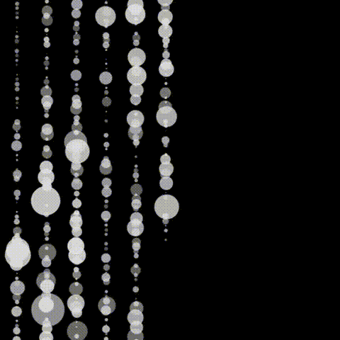

# Project-Mondrian-Animation
## Interaction Instructions

### Overview
The animation consists of a sequence of rectangles that appear, pulsate, and then disappear in a structured manner. This artwork leverages time-based animations and dynamically adjusts to the window size. Below are the details and steps to observe and interact with the animation:

1. Initialization:
   - When you open the webpage or refresh it, the animation will start automatically.

2. Row and Column Animations:
   - The animation starts by drawing a series of coloured squares in rows and columns, one by one, in a sequential order.
   - Each square appears with a 100ms delay after the previous one.
   - Rows and columns continue to be drawn for the first 6500ms, with each subsequent row or column starting after a short delay.

3. Big Rectangle Animations:
   - After the row and column animations finish (approximately 6500ms + 100ms * 49 squares), the big rectangles start appearing.
   - Each big rectangle appears with a 500ms delay after the previous one.
   - These rectangles are positioned and layered from largest to smallest, and they exhibit a pulsating effect.

4. Random Rectangle Animations:
   - Once all the big rectangles have appeared (500ms * 36 rectangles), random rectangles start appearing and disappearing sporadically.
   - These rectangles have random appearance times within 1 second and disappearance times between 500ms to 1500ms.

5. Resizing the Window:
   - You can resize the browser window, and the canvas along with all rectangles will adjust to fit the new dimensions.

### Animation Timing Summary
- Rows and columns are drawn over the first 6500ms with 100ms delays.
- Big rectangles start appearing 200ms after the row/column animations end, with 500ms delays between each rectangle.
- Random rectangles start appearing after all big rectangles have appeared, with random appearance and disappearance times.

## Individual Approach

### Animation Method: Time-Based

The animation in the final code is driven using a time-based approach. This method employs timers and events to control the sequence and behavior of different elements in the animation.

### Overview
The animation consists of two primary types of rectangles:
1. Row and Column Animations：These small squares appear in the order of the rows and columns in sequence
2. Big Rectangles: These rectangles appear sequentially with a pulsating effect.
3. Random Rectangles: These rectangles appear and disappear randomly, creating sporadic visual effects.

### Comparison with Team Member
1. Color Change: An alternative method could involve animating the color of the rectangles, where each rectangle gradually transitions between colors.
2. Line Wave: Another approach could involve animating lines that create a wave effect across the canvas, simulating movement.
3. Movement or Exit: Elements could be animated to move across the screen or exit the canvas, creating a sense of flow and direction.

### Inspiration

> This is the inspiration for the row and column animation.

The provided GIF animation shows a series of circles of varying sizes falling vertically in a continuous stream against a black background. The circles are aligned in multiple columns, creating a pattern that resembles cascading beads or droplets. The circles start from the top and move downward, disappearing as they reach the bottom, and the cycle repeats.

#### Influence on Final Code
- Sequential Appearance of Elements

  - Rows and Columns of Small Squares:

      The time-based approach directly influenced the sequential appearance of small squares in rows and columns. By using delays calculated with the millis() function, each square appears one after another, creating a smooth and rhythmic animation. This technique enhances the visual flow and timing of the animation, making it more engaging.

### Technical Explanation
- Timers and Delays:
   - The `millis()` function tracks elapsed time since the program started. `millis()` keeps track of how long a sketch has been running in milliseconds (thousandths of a second).
- Row and Column Animations:
  - **Rows** and **columns** of small squares appear one after another with a 100ms delay between each square. This is managed by the `drawRow` and `drawColumn` functions.
- Big Rectangles
  - **The pulsation effect** is achieved by modifying the rectangle's width and height based on a sine wave that varies over time.

#### References

- [p5.js `millis()` Function](https://p5js.org/reference/#/p5/millis)
- [Sine Wave Animation](https://natureofcode.com/book/chapter-3-oscillation/)
